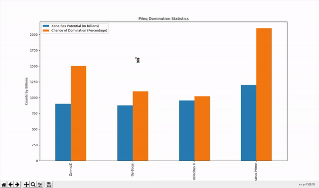

# Loz by Niko Darby 

# Introduction

Greetings all,

My name is Niko Darby and I am the creator of this code. In this project I will be constructing a game titled, "Loz" using the Python coding language. In the code itself, I have attempted to solve the real-world problem of developing a survey that individuals can answer and I constructed a data chart that can be scrutinized immensely. The data chart is not "real" data. Instead, it is prototype data constructed in a Microsoft Excel file and converted into a ".csv" file. 

The code itself will present a plethora of the Python-based abilities that I have mastered this semester. For instance, some of the skills that will be encountered in this code includes building functions, making lists and tuples, understanding SyntaxErrors and how to overcome them [in the test folder], downloading and using packages such as pandas, numpy, or matplotlib.pyplot, and much more. 

  As mentioned previously, this is a code that has been designed to be a game. There will be an abundance of scenarios where you will have the ability to choose the action of a preset character. Your actions will determine how the story will proceed. While examining the folder named "Notebook_Jupyter" you will see the tests performed to improve this project. The folder named "Darby_PythonProject_2019" has the complete code available for your examination.

Enjoy!

#Preview 

# Package Installations

It is necessary to install the following packages if attempting to recapitulate this project. With the packages listed below, you will be able to compile data and utilize the tools necessary for concocting a proper survey code: 

  - pandas
  - numpy 
  - matplotlib.pyplot
  - colorama
  
Upon installation of the packages above, be certain to patch the "matplotlib.pyplot" package to ensure that your charts are able to be displayed upon calling the ".show()" operation. In order to patch this package, you will require the input of " %matplotlib inline" above the import for matplotlib.pyplot. By executing it above, it will act as a barrier for any "bugs" that can inhibit the display of the chart. 

# Linking Your Data 

Many individuals encounter predicaments when attempting to import their data into their shell. To solve this issue, ensure that your data is in an Excel file, in a table-based format. Then, save your Excel file as a ".csv" file. In chronological order, you must first click "save as..". Proceeding this step, you must click the options for the file save. Then, you click ".csv" and finally complete the save. 

After this is complete, you will use the pandas function: pd.read_csv(). As a key step, you must write pd.read_csv(r" the path to your file "). Many may wonder how the path to their file looks. It may be displayed as something like this: "C:\Users\admin\documents\csv_file_name". Of course, you will set this read equal to, for example, "Data" , and begin constructing your charts and graphs from there. 

# Possible References

When developing any coding program, it is quite pleasant to detail any help you received. Credit will go to the following website(s): 

- www.stackoverflow.com

The stackoverflow website was of immense assistance while developing this project. There were many bugs that required cleansing and stackoverflow assisted with tips and guidance as to how to eradicate them. Other key guidances such as how to change the color of the text using the colorama package was procured from the stackoverflow website as well.
